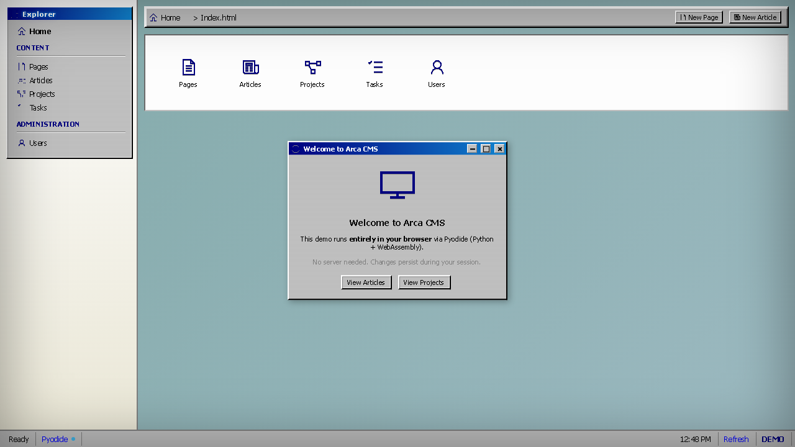
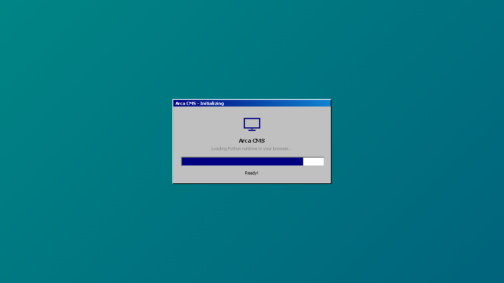
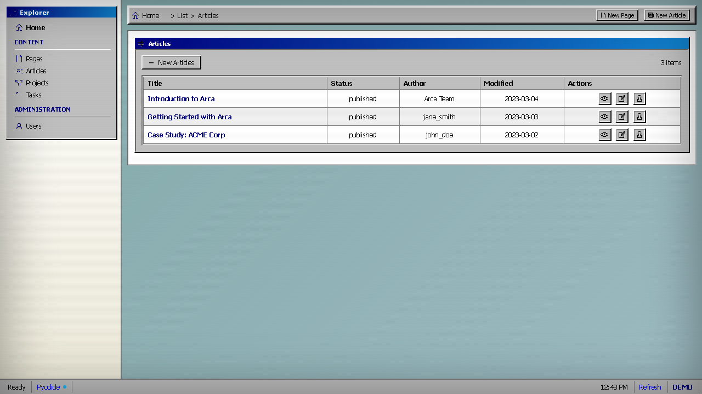
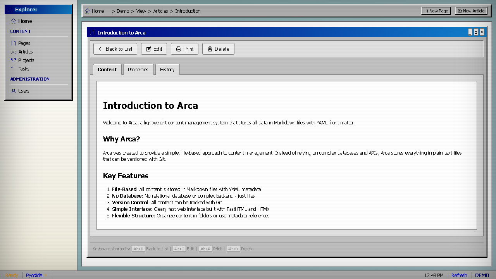
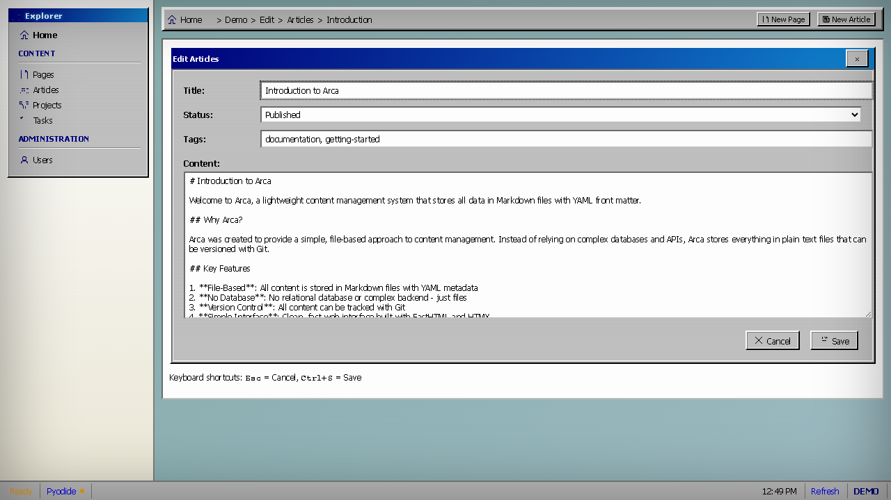

# Arca

An experimental content management system with a Windows 98 aesthetic, built with Python and HTMX. Arca stores content in Markdown files with YAML front matter — no database required.

> **Status**: This is an experimental/learning project. It works, but it's rough around the edges. The codebase is a playground for exploring ideas like file-based CMS, retro UI design, and running Python entirely in the browser via WebAssembly.



## Live Demo

**[Try it in your browser](https://linconvidal.github.io/project-arca/)** — no installation needed.

The demo runs the entire CMS (Python + Flask + HTMX) inside your browser via Pyodide (Python compiled to WebAssembly). There's no server — everything happens client-side. Changes persist during your browser session.



## What it does

Arca manages content organized by type (articles, projects, tasks, pages, users). Each content item is a Markdown file with YAML metadata. The interface is styled after Windows 98 because why not.

### List View

Browse content by type with sortable tables, view/edit/delete actions, and right-click context menus.



### Detail View

View rendered Markdown content with tabbed panels for Content, Properties, and History. Includes keyboard shortcuts.



### Edit Form

Edit content with a simple form. Supports title, status, tags, and Markdown content. Ctrl+S to save, Esc to cancel.



## Architecture

Two modes of operation:

### Local (FastHTML)

The "real" version uses [FastHTML](https://fastht.ml/) as the web framework, with HTMX for frontend interactivity. Content lives on disk as Markdown files, indexed in an ephemeral SQLite database for fast querying.

```
Markdown files → DataManager (SQLite index) → FastHTML routes → HTMX swaps
```

### Browser Demo (Pyodide)

The demo compiles Python to WebAssembly and runs Flask in the browser. A Service Worker intercepts HTTP requests and routes them to the in-browser Flask app via MessageChannel. Content lives in an in-memory Python dict, persisted to `sessionStorage`.

```
Browser loads index.html
  → Registers Service Worker
  → Loads Pyodide (Python in WebAssembly)
  → Installs Flask + Markdown via micropip
  → Runs Flask app with in-memory content store
  → SW intercepts all HTTP requests
  → Routes to Flask via MessageChannel
  → Flask returns HTML → HTMX swaps into DOM
```

## Tech Stack

- **Python** — core language
- **FastHTML** — web framework (local mode)
- **Flask** — web framework (browser demo, runs in Pyodide)
- **HTMX** — frontend interactivity without writing JavaScript
- **Pyodide** — Python compiled to WebAssembly
- **Service Worker** — acts as an HTTP server in the browser
- **Markdown + YAML** — content format
- **SQLite FTS5** — full-text search (local mode)
- **Windows 98 CSS** — because nostalgia

## Running Locally

### Browser Demo (no dependencies)

```bash
python demo/serve.py
# Open http://localhost:8090/demo/index.html
```

### Full Application

```bash
# Install dependencies
pip install -e .

# Start the server
arca serve --content-dir arca/content
# Open http://localhost:8000
```

## Content Structure

```
content/
├── articles/
│   ├── introduction.md
│   └── getting_started.md
├── projects/
│   ├── project_alpha.md
│   └── project_beta.md
├── tasks/
│   └── implement_search.md
└── pages/
    ├── about.md
    └── contact.md
```

Each file has YAML front matter:

```markdown
---
title: Introduction to Arca
status: published
author: Arca Team
tags:
  - documentation
  - getting-started
---

# Introduction to Arca

Your content here in Markdown...
```

## Limitations

This is experimental software:

- The FastHTML integration is basic and may break with newer versions
- The browser demo requires ~30 seconds to load (Pyodide is large)
- Full page navigations in the demo cause Pyodide to reinitialize (mitigated with Service Worker pre-rendering and sessionStorage persistence, but not instant)
- No authentication or authorization
- No image upload or media management
- The Windows 98 CSS is entirely hand-written and incomplete in places
- Error handling is minimal

## License

MIT
